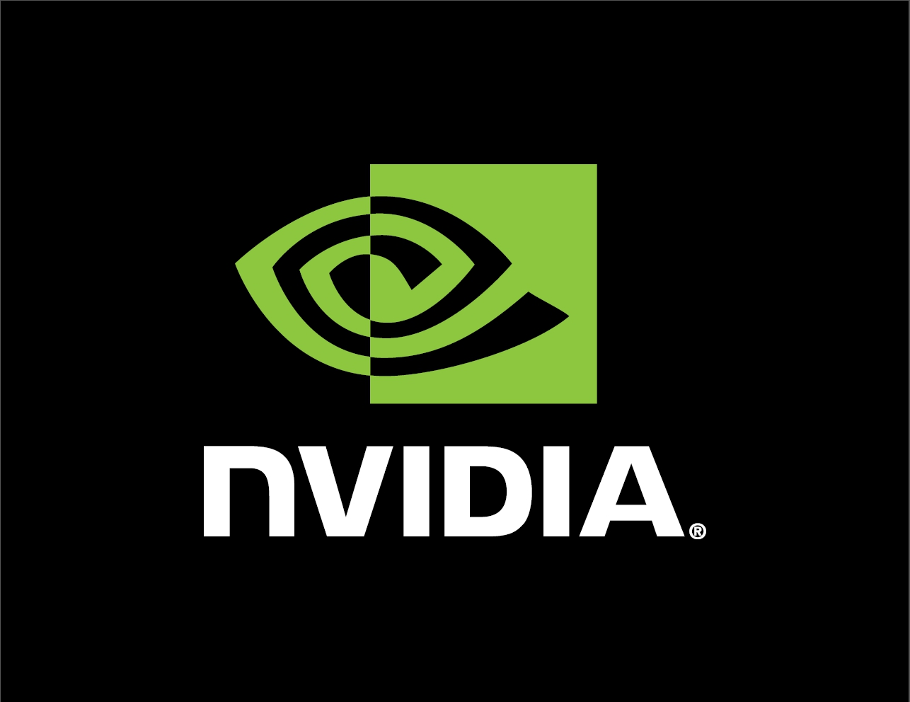

## Applied Research in Academia

* Stochastic Weight Averaging: Wider Optima ==> Better Generalizability
* Gaussian Processes = DNNs + Uncertainty (minimal overhead)
* Opt-Net: Inserting Differentiable QP Layers in a DNN to Encode Constraints and Create Richer Representations ==> Can Solve Sudoku
* Using GANs to remove the need to hand-define loss functions, i.e. the discriminator acts as a learned loss function

## Karpathy's Software 2.0

 

**Goal**. Figure out best software engineering practices for DL.

* Test Driven Development Workflow:
    * 90/10 split not enough anymore.
    * Test Set is extremely important.
    * "Curate your test set", "Massage your Dataset".
    * Should be clean, varied and rich.
    * Edge cases are super important.
    * Fixing a bug is equivalent to changing model architecture, adding more examples of a certain class, etc.
* CI:
    * Automating training, unit testing, and deployment.
    * Rebuild on every change.
* Version Controlling a Dataset:
    * Adding data of a certain type means changing the code.
    * Labels change over time. Think of them as commits.
* Keeping a Model Zoo
* Mono-Repos:
    * 1 shared code base.
    * Minimize dependencies.
    * 1 big network and each subdivision of company fintunes to their needs.

**Summary**. Treat DNNs as code. Adopt software practices to the DL stack.

## Catanzaro's Applied ML

 

* Lots of AI problems to solve, but limiting factor is the **Idea Generation Latency** ==> PyTorch helped reduce this.
* Using AI for Assisting Humans in the Creative Process:
    * Vid2Vid + Frame Prediction ==> Data Generation for Video Games.
    * Supersampling (Anti-Aliasing + Superresolution) ==> Better, Prettier Graphics.
    * Inpainting ==> Helping the Photo-Editing Process, i.e. "Smart Brush".
    * Using Mixed Precision for Training Larger and Faster Unsupervised Language Models ==> Apex takes care of automatic casting (e.g. batch norm bad with fp16).
